# Lecture 1: Introduction to Wireless Communications

**Course:** Mobile Communication Systems (CSD441)  
**Instructor:** Prof. Dr. Hassan Al-Mahdi (Head of Computer Science Department, Suez Canal University)  
**Target Level:** Fourth Level – Computer Science (1st Semester, 2026–2027)  
**Prerequisite:** CSD338  

---

## 🎯 Executive Summary & Core Themes

Lecture 1 establishes the physical, architectural, and mathematical foundations of wireless and mobile communications. The lecture highlights:

1. **The Paradigm Shift (2005 vs. 2025):** Moving from sporadic, low-bandwidth, voice-centric connectivity to ubiquitous, always-on, multi-gigabit wireless ecosystems.
2. **Why Wireless Dominates:** Mobility, exponential device proliferation, high-speed technologies rivaling wired Ethernet, cost-effective infrastructure deployment, and industrial digitization.
3. **Evolutionary Trajectories:**
   - **Cellular Generations (1G to 5G-Advanced & 6G):** From analog voice (AMPS) to digital voice/SMS (GSM), mobile web (UMTS), mobile broadband (LTE), and gigabit/URLLC/massive IoT connectivity (5G NR and 5G-Advanced).
   - **Wi-Fi Standards (802.11b to Wi-Fi 7):** Moving from 11 Mbps (802.11b) up to 46 Gbps (802.11be), spanning 2.4 GHz, 5 GHz, and 6 GHz spectrum.
4. **The Complementary Wireless Dual:** 5G and Wi-Fi 6 are not competitors; they work together (outdoor wide-area mobility vs. indoor high-capacity dense local networks).
5. **Internet of Things (IoT) Connectivity Spectrum:** Trading off data rate, transmission range, power consumption, and hardware cost across short-range (RFID, BLE, Zigbee, UWB), LPWAN (LoRaWAN, Sigfox, NB-IoT, LTE-M), and cellular broadband.
6. **Physical Channel Fundamentals:** The physics of **Channel Gain**, decomposing signal degradation into **Large-Scale Fading** (Path Loss + Shadowing) and **Small-Scale Fading** (Multipath Interference + Doppler Shift).
7. **Architectures & Taxonomy:** Classifying networks across **Infrastructure vs. Ad Hoc vs. Mesh**, and mapping systems into the **2×2 Taxonomy Matrix** (Single-Hop vs. Multi-Hop $\times$ Infrastructure vs. Infrastructure-less).

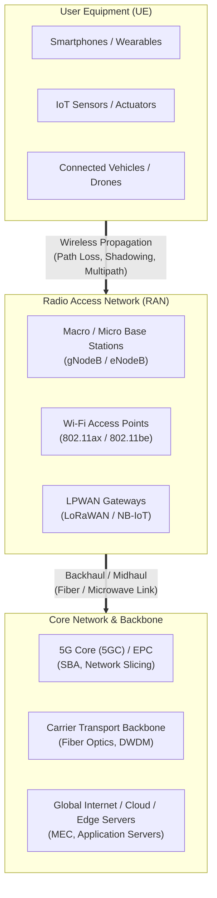

---

## 📖 Module-by-Module In-Depth Technical Breakdown

### Module 1: The Rising Need for Wireless Communication (Slides 5–6)

#### Historical Comparison: The Past (~2005) vs. Modern Era (2025+)

| Metric / Dimension | The Past (Around 2005) | The Modern Era (2025+) |
|---|---|---|
| **Handset Penetration** | Visible only in small numbers at public events | Universal; nearly 100% of crowd carries active smartphones |
| **Media Capture & Sharing** | Standalone consumer electronics (point-and-shoot digital cameras, camcorders) | Integrated smartphone sensor arrays streaming directly to the cloud |
| **Connectivity State** | Ephemeral, session-based dial-up or sporadic 2G/3G browsing | **Always-On, Continuous Telemetry** (background push, sync, location) |
| **Wireless Access Performance** | 802.11b/g Wi-Fi and 3G were slow, metered, and expensive | Multi-Gigabit 5G NR and Wi-Fi 6/7 with unlimited high-speed plans |
| **Dominant Traffic Direction** | Asymmetric Downlink (text, basic web pages, low-res images) | Heavy Symmetric & Uplink (4K live streaming, cloud backup, video calls) |
| **Network Demand Burden** | Low aggregate bandwidth; low concurrency | Massive concurrency, extreme density (stadiums, concerts, dense metro) |

#### The 4-Pillar Demand Feedback Loop (Slide 6)

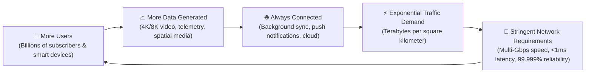

> **Professor's In-Depth Note:**  
> In lecture, the professor emphasizes that mobile data growth is not merely linear with the number of human subscribers. Rather, it is propelled super-linearly by **Machine-to-Machine (M2M)** traffic and autonomous background cloud synchronization. A modern smartphone initiates hundreds of invisible network socket connections per hour even when resting in a pocket. Consequently, network engineers can no longer dimension cellular systems solely based on Erlangs of voice traffic (Poisson call arrivals); they must design for continuous packet-switched bursty data.

---

### Module 2: Wireless Fundamentals & Drivers of Dominance (Slides 7–9)

#### Formal Definition
A **Wireless Network** is an interconnected communications architecture that transfers information between distributed nodes across unguided propagation space without physical conductors (copper wires or optical fibers), utilizing **electromagnetic waves** (Radio Frequency, Microwave, or Infrared).

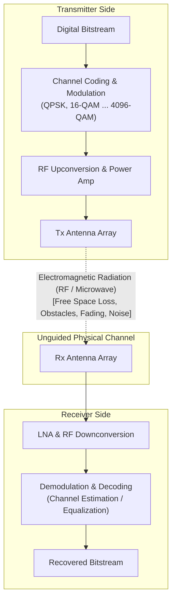

#### The Electromagnetic Spectrum Trade-Off: Frequency vs. Propagation

The fundamental relation governing all wireless transmission is:

$$c = f \cdot \lambda \implies \lambda = \frac{c}{f}$$

Where:
- $c \approx 3 \times 10^8 \text{ m/s}$ (speed of light in vacuum/air),
- $f$ is the carrier frequency (Hz),
- $\lambda$ is the electromagnetic wavelength (meters).

```
Low Frequency (Sub-1 GHz: 700 - 900 MHz)             High Frequency (mmWave: 24 - 100 GHz)
◄────────────────────────────────────────────────────────────────────────────────────────►
• Very long wavelength (λ ≈ 30 - 45 cm)              • Very short wavelength (λ ≈ 3 - 12 mm)
• Excellent ground wave & diffraction coverage       • Line-of-sight required; easily blocked
• Strong penetration through concrete walls/foliage  • Severe attenuation by oxygen & rainfall
• Narrow available channel bandwidth (5 - 20 MHz)   • Massive available channel bandwidth (400 - 800 MHz)
• Target: Wide-area rural coverage & deep indoor IoT • Target: Ultra-dense urban gigabit hotspots
```

#### The Six Driving Factors of Wireless Dominance (Slides 8–9)

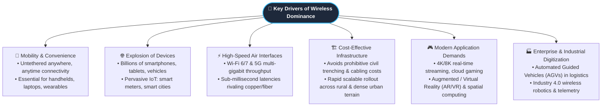

---

### Module 3: Wireless Application Ecosystems (Slide 10)

Wireless communication powers an interconnected matrix of specialized cyber-physical domains:

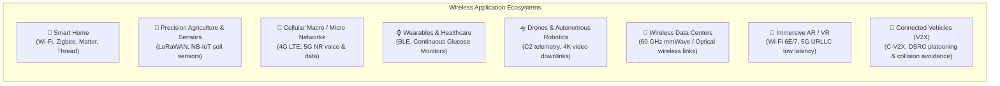

1. **Smart Homes:** Mesh architectures (Zigbee, Thread, Matter) orchestrate low-power ambient lighting, HVAC thermostats, smart locks, and IP surveillance cameras without bogging down central routers.
2. **Wireless Sensor Networks (WSN):** Battery-operated remote sensor motes measuring soil pH, moisture, vibration, seismic activity, and forest fire indicators.
3. **Cellular Networks:** High-power macrocells combined with urban small cells providing carrier-grade voice, broadband, and emergency communications.
4. **Wearable Health Monitoring:** Low-energy body area networks (BAN) transmitting real-time ECG, blood oxygen (SpO2), and glucose data to personal handsets and clinical dashboards.
5. **Drones & Unmanned Aerial Systems (UAS):** Dual wireless links: reliable sub-GHz command-and-control (C2) link combined with high-throughput 5.8 GHz / 5G video downlink.
6. **Wireless Data Centers:** Reconfigurable mmWave / terahertz point-to-point wireless top-of-rack interconnects eliminating complex physical fiber patching.
7. **Augmented / Virtual Reality (AR/VR):** Demands sustained data rates (>100 Mbps) with motion-to-photon latency under 20 ms to prevent motion sickness.
8. **Connected Autonomous Vehicles (V2X):** Vehicle-to-Vehicle (V2V), Vehicle-to-Infrastructure (V2I), and Vehicle-to-Pedestrian (V2P) broadcast sharing speed, position, and braking status 10 times per second for automated collision avoidance.

---

### Module 4: Mobile Cellular Generations Evolution (1G to 5G-A & 6G) (Slides 11–14)

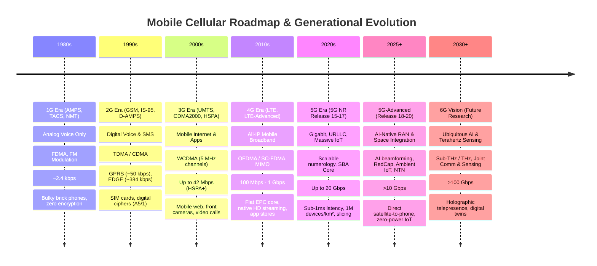

#### Detailed Generational Technical Comparison

| Feature / Metric | 1G | 2G | 3G | 4G (LTE / LTE-A) | 5G (5G NR) | 5G-Advanced (5G-A) |
|---|---|---|---|---|---|---|
| **Primary Service** | Analog Voice | Digital Voice, SMS, basic data | Mobile Web, multimedia | High-Speed Mobile Broadband | eMBB, URLLC, mMTC | AI-RAN, RedCap, Satellite NTN |
| **Multiple Access** | FDMA | TDMA / CDMA | WCDMA / CDMA2000 | OFDMA (DL) / SC-FDMA (UL) | Scalable OFDMA | Scalable OFDMA + AI scheduling |
| **Channel Bandwidth** | 30 kHz (AMPS) | 200 kHz (GSM) | 5 MHz (UMTS) | 1.4 – 20 MHz (up to 100 MHz CA) | Up to 100 MHz (Sub-6) / 400 MHz (mmWave) | Multi-carrier aggregation + NTN |
| **Peak Data Rate** | ~2.4 kbps | 9.6 kbps (GSM) → 384 kbps (EDGE) | 2 Mbps (UMTS) → 42 Mbps (HSPA+) | 100 Mbps – 1 Gbps | Up to 10 – 20 Gbps | > 10 Gbps sustained |
| **End-to-End Latency** | N/A (Analog) | ~300 – 1000 ms | ~100 – 200 ms | 20 – 50 ms | 1 – 4 ms (sub-ms in URLLC) | Deterministic sub-ms |
| **Core Network** | Analog PSTN Switches | Circuit-Switched (SS7) + SGSN/GGSN | Dual Core (CS voice + PS packet) | Pure All-IP Evolved Packet Core (EPC) | Service-Based Architecture (5GC SBA) | Autonomous AI-driven Cloud-Native Core |
| **Security Mechanism** | None (cloning, eavesdropping) | Symmetric A5 encryption, SIM card | Mutual authentication (USIM), KASUMI | AES-128, IPsec, EPS-AKA | 256-bit encryption, SUPI encryption, 5G-AKA | Zero-Trust, quantum-resistant algorithms |

#### The Cellular Concept & Frequency Reuse (Foundational Theory)

> **Professor's In-Depth Note:**  
> A critical concept in mobile communications is understanding why early wireless networks could only support dozens of users in an entire city, whereas modern cellular networks support millions.  
> Early mobile telephony (like IMTS) used a single high-power transmitter situated on top of the tallest mountain or skyscraper, broadcasting over a 50 km radius. Because spectrum is finite, once all channels were in use, no one else could place a call.  
> The **Cellular Concept** (invented at Bell Labs) solved this by replacing one high-power transmitter with many low-power transmitters distributed across small geographic cells. Because power decays rapidly with distance, the **same radio frequency channels can be reused** in different cells, provided the cells are separated by sufficient geographic distance to prevent co-channel interference!

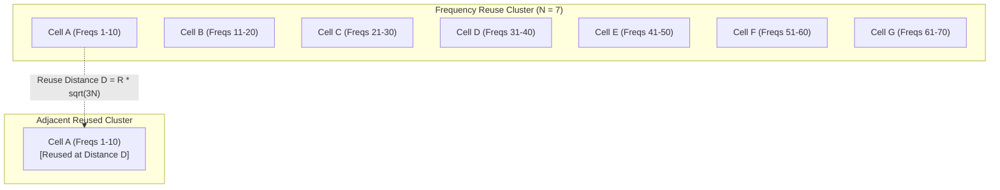

##### Frequency Reuse Factor ($N$)
A cluster of $N$ cells uses the total available spectrum. The geometry of regular hexagons dictates that $N$ must satisfy:

$$N = i^2 + i \cdot j + j^2 \quad (i, j \in \mathbb{N}_0) \implies N \in \{1, 3, 4, 7, 9, 12, 19, \dots\}$$

##### Co-Channel Reuse Ratio ($Q$)

$$Q = \frac{D}{R} = \sqrt{3N}$$

Where $D$ is the distance between co-channel cell centers, and $R$ is the cell radius. A larger $N$ increases distance $D$, reducing **Co-Channel Interference (CCI)**, but divides total bandwidth across more cells, reducing local capacity.

#### The 5G Service Triangle: eMBB, URLLC, mMTC (Slide 16)

```
                            eMBB
                  (Enhanced Mobile Broadband)
                   • Peak Data Rates: 20 Gbps
                   • 4K/8K Video, AR/VR
                   • High User Mobility
                            ▲
                           / \
                          /   \
                         /     \
                        /   5G  \
                       /         \
                      /           \
                     /             \
                    /               \
                   /                 \
                  ▼                   ▼
            URLLC                      mMTC
(Ultra-Reliable Low-Latency)  (Massive Machine-Type Comms)
 • Latency: < 1 ms             • Density: 1,000,000 devices/km²
 • Reliability: 99.9999%       • 10-year battery life
 • Autonomous Driving,         • Smart Meters, Agriculture,
   Remote Robotic Surgery        Smart City Sensors
```

#### 5G-Advanced (5G-A) Core Breakthroughs (Slide 14)
- **AI-Enhanced Air Interface:** Machine learning models embedded directly in the PHY layer for channel state estimation, massive MIMO beam prediction, and proactive sleep scheduling for 30%+ energy savings in cell towers.
- **Ambient IoT:** Passive and semi-passive IoT nodes that operate without batteries by backscattering incident ambient radio waves (RFID evolved to cellular scales).
- **RedCap (Reduced Capability / NR-Light):** Fills the cost/power gap between high-end 5G smartphones and low-rate LPWAN sensors. RedCap devices use 20 MHz channel bandwidth, 1 or 2 antennas, and achieve ~150 Mbps with battery lifespans measured in years.
- **Non-Terrestrial Networks (NTN):** Direct integration of Low Earth Orbit (LEO) and Geostationary (GEO) satellite constellations into the 3GPP cellular standard, enabling ordinary consumer handsets to connect via satellite in remote oceans, deserts, or during terrestrial disaster outages.

---

### Module 5: Wi-Fi Standards Evolution (802.11b to Wi-Fi 7) (Slide 15)

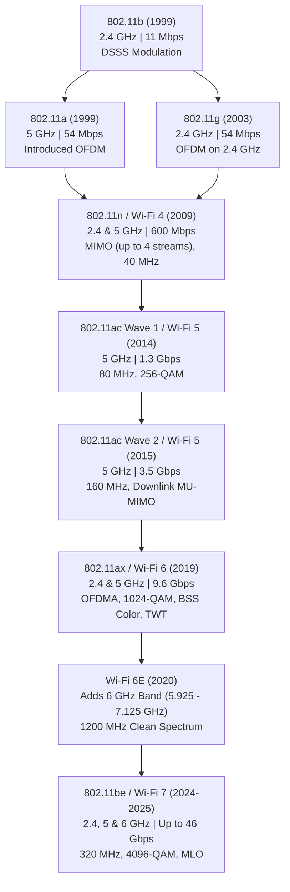

#### Detailed Wi-Fi Specifications Matrix

| Standard | Commercial Brand | Year | Bands | Max Theoretical PHY Rate | Max Channel Bandwidth | Modulation | Antenna Tech (MIMO) | Key Feature |
|---|---|:---:|:---:|:---:|:---:|:---:|:---:|---|
| **802.11b** | — | 1999 | 2.4 GHz | 11 Mbps | 22 MHz | DSSS / CCK | SISO (1x1) | First popular consumer wireless LAN |
| **802.11a** | — | 1999 | 5 GHz | 54 Mbps | 20 MHz | OFDM | SISO (1x1) | Uncongested 5 GHz band |
| **802.11g** | — | 2003 | 2.4 GHz | 54 Mbps | 20 MHz | OFDM | SISO (1x1) | Backwards-compatible with 802.11b |
| **802.11n** | **Wi-Fi 4** | 2009 | 2.4 / 5 GHz | 600 Mbps | 40 MHz | 64-QAM | MIMO (up to 4x4) | Channel bonding (40 MHz), Frame aggregation |
| **802.11ac W1**| **Wi-Fi 5** | 2014 | 5 GHz only | 1.3 Gbps | 80 MHz | 256-QAM | 3x3 MIMO | 80 MHz wide channels, 256-QAM |
| **802.11ac W2**| **Wi-Fi 5** | 2015 | 5 GHz only | 3.5 Gbps | 160 MHz | 256-QAM | DL MU-MIMO (4x4) | 160 MHz channel bonding, Downlink MU-MIMO |
| **802.11ax** | **Wi-Fi 6** | 2019 | 2.4 / 5 GHz | 9.6 Gbps | 160 MHz | 1024-QAM | Bi-directional MU-MIMO (8x8) | **OFDMA**, **BSS Coloring**, **Target Wake Time (TWT)** |
| **Wi-Fi 6E** | **Wi-Fi 6E**| 2020 | 2.4 / 5 / 6 GHz| 9.6 Gbps | 160 MHz | 1024-QAM | 8x8 MU-MIMO | 1.2 GHz of pristine spectrum in 6 GHz band |
| **802.11be** | **Wi-Fi 7** | 2024–25 | 2.4 / 5 / 6 GHz| **46.1 Gbps** | **320 MHz** | **4096-QAM** | 16x16 MU-MIMO | **Multi-Link Operation (MLO)**, 320 MHz channels |

#### Understanding Key Wi-Fi 6/7 Mechanisms
1. **OFDM vs. OFDMA (Orthogonal Frequency Division Multiple Access):**
   - *Legacy OFDM:* In any given transmission time slot, only **one single device** occupies the entire channel bandwidth, even if it only needs to send a 50-byte ACK packet.
   - *Wi-Fi 6 OFDMA:* Divides the channel into granular frequency sub-channels called **Resource Units (RUs)** (26, 52, 106, 242, 484, or 996 tones). Up to 37 different clients can transmit or receive simultaneously within a single 20 MHz channel, slashing packet latency in dense crowds.
2. **BSS Coloring (Spatial Reuse):**
   - In legacy Wi-Fi, if an AP detects any RF transmission on its channel with signal above clear-channel assessment (CCA) threshold, it backs off and waits.
   - BSS Coloring assigns a 6-bit numerical color (1 to 63) to each BSS. If a device hears a transmission of a *different color* below an interference threshold, it can safely transmit concurrently, dramatically multiplying spatial capacity.
3. **Target Wake Time (TWT):**
   - AP coordinates exact schedules with clients determining when they wake up to exchange beacons and frames. IoT devices sleep 99% of the time, extending battery lifespan from days to years.
4. **Multi-Link Operation (MLO) in Wi-Fi 7:**
   - Instead of choosing between 2.4 GHz, 5 GHz, or 6 GHz, Wi-Fi 7 devices can aggregate data simultaneously over multiple bands or instantly switch bands without packet loss.

---

### Module 6: Wi-Fi 6 vs. 5G: The Complementary Relationship (Slide 16)

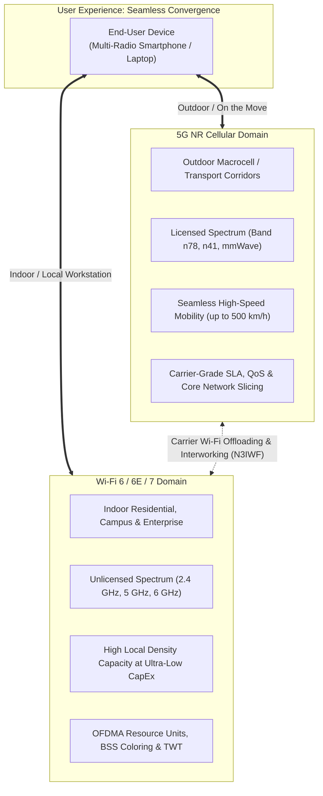

#### Architectural Comparison Table

| Attribute | 5G NR Cellular | Wi-Fi 6 (IEEE 802.11ax) |
|---|---|---|
| **Operational Realm** | Wide-Area Outdoor, Urban Macrocells, High-Speed Mobility | Local Indoor, Enterprise, Residential, Dense Public Venues |
| **Radio Spectrum** | **Licensed Spectrum** (exclusive operator ownership; interference-free) | **Unlicensed Spectrum** (shared public ISM / UNII bands; free to use) |
| **Mobility & Roaming** | Seamless, hard/soft handovers at speeds up to 500 km/h | Local nomadic roaming (802.11k/v/r); not designed for vehicular handoffs |
| **Deployment Economics**| High CapEx/OpEx (Towers, telco equipment, spectrum auctions, fiber) | Low CapEx (Inexpensive off-the-shelf APs connected to local switches) |
| **Primary Radio Access**| Scalable OFDMA, Massive MIMO Beamforming, Dynamic TDD | OFDMA with Resource Units, MU-MIMO, BSS Coloring, TWT |
| **Quality of Service (QoS)**| Guaranteed carrier-grade SLA with deterministic Network Slicing | Prioritized contention-based best-effort (WMM EDCA access categories) |
| **Security Architecture**| Carrier SIM-based 5G-AKA mutual authentication, encrypted SUPI | WPA3-Personal (SAE) / WPA3-Enterprise (802.1X EAP-TLS) |

---

### Module 7: Internet of Things (IoT) & Connectivity Spectrum (Slides 17–18)

#### The 3-Step IoT Control Loop (Slide 17)

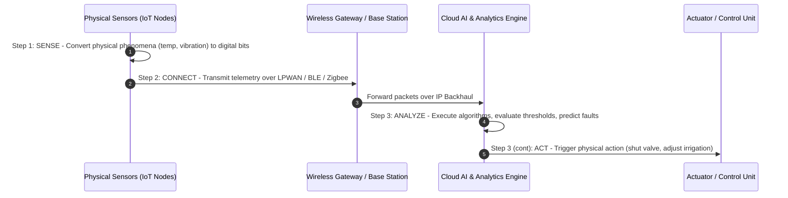

#### The IoT Connectivity Technology Landscape (Slide 18)

```
Data Rate / Power
  ▲
  │                                    [Cellular Broadband]
  │                                     (4G LTE, 5G NR)
100 Mbps ────────────── [Wi-Fi 4/5/6]  (Video cams, gateways, connected cars)
  │                     (Local high-data)
  │     [Bluetooth Classic]
1 Mbps ─── (~10m) ───── [Wi-Fi HaLow]
  │                     (802.11ah, sub-1GHz, 1 km)
  │             [UWB]
100 kbps ── [BLE] ── [Zigbee/Thread/Z-Wave] ── [Licensed LPWAN: LTE-M, NB-IoT, RedCap]
  │        (Wearables)   (Smart Home mesh)    (Smart utility meters, asset tracking, 1-10+ km)
  │
1 kbps ── [RFID/NFC] ───────────────────────── [Unlicensed LPWAN: LoRaWAN, Sigfox, MIOTY]
  │       (Access badges, 1m)                 (Precision agriculture, city telemetry, 15+ km)
  └─────────────┬──────────────┬──────────────┬──────────────┬──────────────► Range
               1 m            10 m           100 m           1 km           10+ km
```

#### In-Depth Comparison of IoT Protocols

1. **RFID & NFC (Near Field Communication):**
   - Operates via magnetic inductive coupling at 13.56 MHz (NFC) or backscatter at UHF (860–960 MHz RFID).
   - Range: < 10 cm (NFC) to ~5–10 m (Passive UHF RFID). Passive tags have no battery; powered by the reader's EM field.
2. **Bluetooth Low Energy (BLE):**
   - Operates in 2.4 GHz ISM band using 40 channels (3 advertising, 37 data channels) with Frequency Hopping Spread Spectrum (FHSS).
   - Energy consumption is a fraction of Bluetooth Classic due to aggressive duty cycling.
3. **Ultra-Wideband (UWB):**
   - Transmits ultra-short pulses (nanosecond duration) across 500 MHz+ bandwidths in the 3.1–10.6 GHz band.
   - Measures Time-of-Flight (ToF) and Angle-of-Arrival (AoA) with **centimeter-level spatial accuracy**, resistant to multipath reflections.
4. **Low-Power Wide-Area Networks (LPWAN):**
   - **LoRaWAN (Unlicensed):** Uses **Chirp Spread Spectrum (CSS)** modulation in sub-GHz bands (868 MHz EU, 915 MHz US). Outstanding link budget (up to 154 dB), achieving 15+ km range in rural areas and 10+ year battery life.
   - **Sigfox (Unlicensed):** Uses **Ultra-Narrowband (UNB)** (100 Hz bandwidth) transmitting tiny 12-byte payloads up to 140 times per day.
   - **NB-IoT (Licensed 3GPP):** Uses 180 kHz bandwidth (equivalent to 1 LTE Physical Resource Block). Deploys in-band, guard-band, or standalone with deep building/subterranean penetration (+20 dB link budget gain over conventional GSM).
   - **5G RedCap (Reduced Capability):** 20 MHz channel, 1 Tx / 1-2 Rx antennas, half-duplex FDD, bridging the gap for industrial cameras and smart wearables.

---

### Module 8: Wireless Propagation Characteristics & Channel Gain (Slides 19–21)

#### Mathematical Definition of Channel Gain ($G$)

The **Channel Gain** $G$ (or power transfer ratio) is defined as the ratio of received signal power ($P_r$) to transmitted signal power ($P_t$):

$$G = \frac{P_r}{P_t}$$

Expressed in decibels (dB):

$$G_{\text{dB}} = 10 \log_{10}(G) = 10 \log_{10}(P_r) - 10 \log_{10}(P_t) = P_{r,\text{dBm}} - P_{t,\text{dBm}} = - \text{Path Loss}_{\text{dB}}$$

```
Transmitter (Pt)                                             Receiver (Pr)
     ((•))                                                        ((•))
       │                                                            │
       ├───► [Free Space Path Loss: ∝ 1/d^n] ───────────────────────┤
       ├───► [Shadowing: Large obstacles / Log-Normal] ─────────────┤  G = Pr / Pt
       ├───► [Multipath: Reflection, Diffraction, Scattering] ──────┤
       └───► [Doppler Shift: Motion-induced frequency offset] ──────┘
```

#### The Four Fundamental Channel Degradations (Slide 20)

##### 1. Path Loss ($PL$)
The deterministic reduction in power density as an electromagnetic wave expands in space.

**Friis Free-Space Transmission Equation:**

$$P_r = P_t \cdot G_t \cdot G_r \cdot \left(\frac{\lambda}{4\pi d}\right)^2 = P_t \cdot G_t \cdot G_r \cdot \left(\frac{c}{4\pi f d}\right)^2$$

In practical terrestrial environments, path loss follows the **Empirical Log-Distance Model**:

$$PL(d)_{\text{dB}} = PL(d_0)_{\text{dB}} + 10 \cdot n \cdot \log_{10}\left(\frac{d}{d_0}\right)$$

Where $n$ is the **Path Loss Exponent**:
- **Free space:** $n = 2.0$
- **Urban macrocell:** $n = 3.5 - 4.5$
- **Dense urban with obstructions:** $n = 4.0 - 6.0$
- **Indoor Line-of-Sight (waveguide corridor effect):** $n = 1.6 - 1.8$

##### 2. Shadowing ($X_\sigma$)
Large-scale signal attenuation caused by massive geographic objects (buildings, hills, overpasses) obstructing the main Fresnel zone.

Modeled statistically as a **Log-Normal Random Variable**:

$$X_\sigma \sim \mathcal{N}(0, \sigma^2_{\text{dB}})$$

Where the standard deviation $\sigma_{\text{dB}}$ typically ranges from 4 dB to 12 dB depending on terrain clutter.

##### 3. Multipath Fading
Arises from electromagnetic waves encountering physical boundaries:
- **Reflection:** Surface dimensions $\gg \lambda$ (e.g., building walls, ground plane).
- **Diffraction:** Wave encounters sharp edges/corners, bending into the geometric shadow region (Huygens' Principle).
- **Scattering:** Surface dimensions $\le \lambda$ (e.g., foliage, lampposts, gravel).

Multiple delayed wavefronts arrive at the receiver with differing phase shifts $\phi_i$:

$$r(t) = \sum_{i=1}^{N} a_i(t) \cos(2\pi f_c t + \phi_i(t))$$

When phases align ($\Delta \phi = 0^\circ$), they interfere **constructively** (signal peak); when out of phase ($\Delta \phi = 180^\circ$), they interfere **destructively** (deep signal null, attenuation of 30–40 dB over centimeters!).

##### 4. Doppler Shift ($f_d$)
Frequency displacement caused by relative velocity vector $v$ at angle $\theta$ relative to the arriving wave:

$$f_d = \frac{v}{\lambda} \cos(\theta) = \frac{v \cdot f_c}{c} \cos(\theta)$$

Generates spectral broadening (Doppler spread), causing rapid phase dispersion in mobile environments.

#### Large-Scale vs. Small-Scale Fading Decomposition

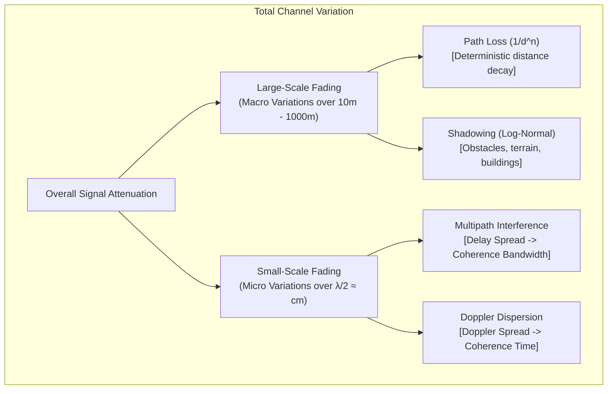

```
Channel Gain (log scale)
  ▲
  │ \
  │  \ - - - - - - - - - - - - - - - Path Loss (Smooth decay over distance)
  │   \  ~ ~ ~ ~ ~ ~ ~ ~ ~ ~ ~ ~ ~ ~ Path Loss + Shadowing (Large-Scale Fading)
  │    \/\/\/\/\/\/\/\/\/\/\/\/\/\/\ Path Loss + Shadowing + Multipath (Small-Scale Fading)
  │     \
  └─────────────────────────────────────────────────────────────────────────────► Distance (log scale)
```

#### Coherence Metrics: The Two Pillars of Wireless Channel Design

> **Professor's In-Depth Note:**  
> In advanced mobile communications exams, the professor frequently tests the duality between the time domain and frequency domain channel characteristics:

##### Pillar 1: Multipath Delay Spread ($\Delta \tau$) $\longleftrightarrow$ Coherence Bandwidth ($B_c$)
The multipath delay spread $\Delta \tau = \tau_{\max} - \tau_{\min}$ is the time difference between the earliest and latest arriving multipath components.

**Coherence Bandwidth ($B_c$):** The frequency span over which two signal components experience correlated fading:

$$B_c \approx \frac{1}{2\pi \cdot \Delta \tau} \quad \left(\text{or } \frac{1}{5 \cdot \Delta \tau}\right)$$

- **Flat Fading** ($B_{\text{signal}} \ll B_c$): All frequency components in the signal fade together. No Inter-Symbol Interference (ISI).
- **Frequency-Selective Fading** ($B_{\text{signal}} \gg B_c$): Different frequency components experience different attenuation and nulls. Causes severe ISI!
- **Why OFDM is used in 4G/5G/Wi-Fi:** OFDM breaks a wideband frequency-selective channel into thousands of narrow orthogonal subcarriers, each having bandwidth $\Delta f \ll B_c$, turning a complex frequency-selective fading channel into simple flat-fading sub-channels!

##### Pillar 2: Doppler Spread ($f_d$) $\longleftrightarrow$ Coherence Time ($T_c$)
**Coherence Time ($T_c$):** The time duration over which the channel impulse response remains essentially invariant:

$$T_c \approx \frac{1}{f_d} \approx \frac{c}{v \cdot f_c}$$

- **Slow Fading** ($T_{\text{symbol}} \ll T_c$): Channel remains static across multiple symbol transmissions.
- **Fast Fading** ($T_{\text{symbol}} \gg T_c$): Channel changes significantly while a single symbol is in flight, distorting the waveform shape.

#### Engineering Applications of Channel Gain (Slide 21)

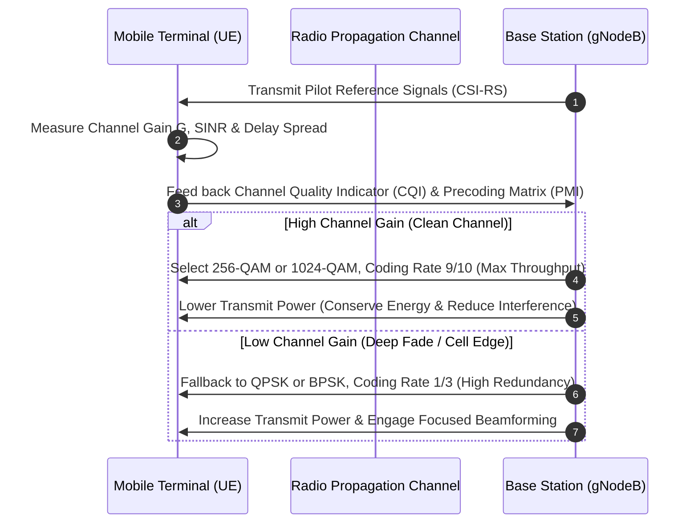

##### 1. Signal-to-Noise Ratio (SNR) & Shannon Capacity Bound
The received SNR is directly proportional to channel gain $G$:

$$\text{SNR} = \frac{P_r}{N_0 \cdot B} = \frac{P_t \cdot G}{N_0 \cdot B}$$

According to the **Shannon-Hartley Theorem**, maximum theoretical channel capacity $C$ is strictly bounded by:

$$C = B \cdot \log_2(1 + \text{SNR}) = B \cdot \log_2\left(1 + \frac{P_t \cdot G}{N_0 \cdot B}\right) \quad [\text{bits/second}]$$

##### 2. Adaptive Modulation & Coding (AMC)
Dynamic rate adaptation matching modulation order (QPSK → 16-QAM → 64-QAM → 256-QAM → 1024-QAM) to instantaneous channel gain.

##### 3. Power Control
Downlink and uplink power control adjusting transmit power to combat near-far problems and preserve mobile battery.

##### 4. Beamforming
Phased array antenna elements adjust phase shifts $\Delta \theta_k$ based on channel state information (CSI) to direct narrow electromagnetic beams directly toward the target receiver, boosting effective channel gain.

---

### Module 9: Wireless Environments & Systems Classification (Slides 22–24)

#### Four Key Realities of Wireless Environments (Slide 22)
1. **Time-Varying Dynamics:** Channels fluctuate dynamically due to terminal movement, moving scatterers, and atmospheric changes.
2. **Broadcast Nature of the Channel:** Radio signals radiate omnidirectionally through open space. All nodes share the identical physical medium, necessitating multiple access control protocols (TDMA, FDMA, CDMA, OFDMA, CSMA/CA) to arbitrate access and avoid packet collisions.
3. **Open & Inherently Vulnerable Medium:** Anyone with an RF receiver within coverage range can intercept packets. Physical perimeter security (locked doors) is ineffective; communications require end-to-end cryptographic encryption (AES), message authentication codes (MAC), and cryptographic key handshakes.
4. **Heterogeneous Node Mobility:** Networks must simultaneously coordinate static infrastructure nodes (base stations, IoT water meters) and highly dynamic mobile nodes (high-speed vehicular transceivers, drones).

#### Nomadic vs. Mobile Systems (Slide 23)

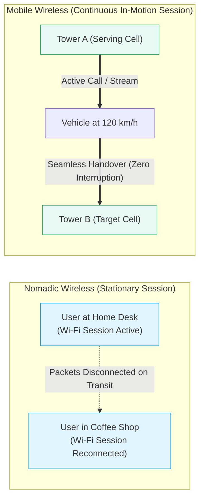

- **Nomadic Systems:** Designed for portable devices where data sessions occur while the device is stationary. Handover between access points is either non-existent or disruptive (session reset). Examples: Standard Wi-Fi (802.11b/g/n), Bluetooth.
- **Mobile Systems:** Specifically engineered with real-time tracking, Doppler compensation, and seamless handoff algorithms that switch base stations at highway and bullet-train speeds without dropping ongoing VoIP calls or video streams. Examples: 3G UMTS, 4G LTE, 5G NR.

#### Handoff / Handover Mechanics (In-Depth Telephony Theory)

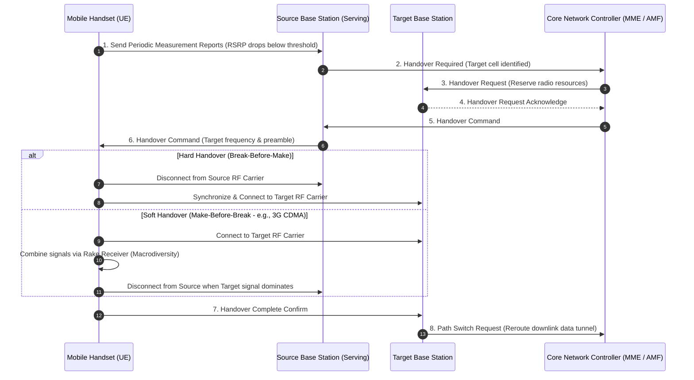

#### Comparison of Network Architectures (Slide 24)

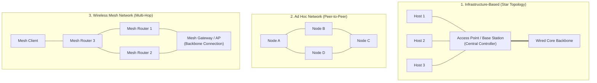

| Architectural Metric | Infrastructure-Based | Ad Hoc Networks | Wireless Mesh Networks |
|---|---|---|---|
| **Central Controller** | **Yes** (Base Station / AP coordinates all access) | **No** (Fully distributed peer nodes) | **Partially Distributed** (Mesh routers cooperate; Gateways bridge to core) |
| **Network Topology** | Strict **Star Topology** | Peer-to-Peer Graph | **Multi-Hop Mesh Graph** |
| **Mobility Management** | Centralized, seamless handover | Highly limited; dynamic topology breakages | Moderate |
| **Deployment Model** | Planned, high upfront infrastructure cost | Spontaneous, instant, zero pre-existing infrastructure | Scalable, incremental, self-configuring |
| **Failure Vulnerability**| Single Point of Failure at central AP/BS | Individual node departures break paths | **Self-Healing:** Traffic dynamically reroutes around failed mesh nodes |
| **Representative Examples**| 4G/5G Cellular, Wi-Fi BSS | Bluetooth Piconet, Wi-Fi Direct, Disaster Rescue MANET | Smart City Streetlights, Municipal Wi-Fi, Military MANET |

---

### Module 10: Structural Elements & The 2×2 Taxonomy (Slides 25–26)

#### The Four Structural Elements of a Wireless Network (Slide 25)
1. **Wireless Hosts:** End-user hardware platforms running client applications (smartphones, IoT telemetry sensors, connected cars).
2. **Base Stations / Access Points:** Fixed radio transceiver infrastructure managing channel access, modulation, radio resource control, and physical bridging to the wired network.
3. **Wireless Links:** The unguided physical propagation path over radio spectrum connecting hosts to base stations or peer hosts.
4. **Network Infrastructure:** The core switched network (Internet, EPC/5GC core, WAN, cloud servers) providing authentication, routing, and backhaul connectivity.

#### The 2×2 Taxonomy Matrix (Slide 26)

```
                      +---------------------------------------+---------------------------------------+
                      |               SINGLE HOP              |              MULTIPLE HOPS            |
+---------------------+---------------------------------------+---------------------------------------+
|                     | [Infrastructure Single-Hop]           | [Infrastructure Multi-Hop]            |
|        WITH         | Host connects directly to a single    | Host reaches an AP/gateway by hopping |
|   INFRASTRUCTURE    | fixed AP/BS with wired Internet link. | through one or more wireless relays.  |
|                     | Examples:                             | Examples:                             |
|                     | • Standard Wi-Fi with Home Router     | • Wireless Mesh Network with Gateway  |
|                     | • Conventional 4G/5G Cellular         | • Multi-Hop Cellular Relay Backhaul   |
+---------------------+---------------------------------------+---------------------------------------+
|                     | [Ad Hoc Single-Hop]                   | [Ad Hoc Multi-Hop]                    |
|       WITHOUT       | Two or more devices communicate       | Peer devices relay data across        |
|   INFRASTRUCTURE    | directly without an AP or Internet.   | multiple intermediate nodes without   |
|                     | Examples:                             | any central AP or core network.       |
|                     | • Bluetooth File Transfer (OBEX)      | • MANET (Mobile Ad Hoc Networks)      |
|                     | • Wi-Fi Direct P2P Connection         | • VANET (Vehicular Ad Hoc Networks)   |
+---------------------+---------------------------------------+---------------------------------------+
```

```mermaid
graph TD
    subgraph Quad1["Infrastructure Single-Hop"]
        Q1_Host["Smartphone"] == "Single Wireless Hop" ==> Q1_BS["Cellular Base Station"]
        Q1_BS === Q1_Core["Internet / Core"]
    end

    subgraph Quad2["Infrastructure Multi-Hop"]
        Q2_Host["Remote Client"] == "Hop 1" ==> Q2_Relay["Wireless Mesh Node"]
        Q2_Relay == "Hop 2" ==> Q2_GW["Mesh Gateway"]
        Q2_GW === Q2_Core["Internet / Core"]
    end

    subgraph Quad3["Ad Hoc Single-Hop"]
        Q3_DevA["Phone A"] <== "Direct Peer Hop (Bluetooth / Wi-Fi Direct)" ==> Q3_DevB["Phone B"]
    end

    subgraph Quad4["Ad Hoc Multi-Hop"]
        Q4_NodeA["Vehicle A"] == "Hop 1" ==> Q4_NodeB["Vehicle B"]
        Q4_NodeB == "Hop 2" ==> Q4_NodeC["Vehicle C (VANET)"]
    end
```

---

## ❓ Comprehensive Question Bank (105 Multiple Choice Questions)

### Section A: History, Fundamentals & Cellular Generational Evolution (Q1 – Q25)

#### Q1. According to the Shannon-Hartley Theorem, what are the two primary physical parameters that bound the theoretical maximum capacity $C$ of a bandlimited channel?
- (A) Antenna physical height and battery chemical voltage
- (B) Channel Bandwidth ($B$) and Signal-to-Noise Ratio ($\text{SNR}$)
- (C) Carrier frequency and software operating system
- (D) Cable thickness and impedance matching resistance
> **Answer: (B)**  
> **Explanation:** The Shannon Capacity theorem states $C = B \log_2(1 + \text{SNR})$, proving that capacity can only be increased by expanding channel bandwidth $B$ or boosting the received signal-to-noise ratio.

#### Q2. In cellular network engineering, what is the primary operational objective of the "Frequency Reuse" technique?
- (A) To eliminate the need for base station antennas
- (B) To reuse the same radio frequency channels in geographically separated cells to multiply system capacity without increasing total spectrum
- (C) To convert analog radio signals into acoustic sound waves
- (D) To ensure all base stations transmit at the exact same power level
> **Answer: (B)**  
> **Explanation:** Frequency reuse allows the same set of frequencies to be reused in different cells separated by a minimum reuse distance $D$, preventing co-channel interference while multiplying system capacity across an entire metropolitan area.

#### Q3. In the comparison between public event crowds in 2005 versus 2025 (Slides 5–6), what was a primary technological characteristic of the 2005 era?
- (A) Pervasive 5G standalone networks
- (B) People utilized standalone digital cameras and camcorders rather than always-connected smartphones
- (C) Multi-gigabit Wi-Fi 6 was ubiquitous
- (D) Mobile data traffic was higher than wired Internet traffic
> **Answer: (B)**  
> **Explanation:** Around 2005, mobile internet was slow, expensive, and limited; individuals relied on standalone digital cameras/camcorders, and devices were not constantly online.

#### Q4. Which of the following best models the modern growth cycle of mobile internet demand described in Slide 6?
- (A) More Users → More Data per User → Always Connected → Higher Network Demand
- (B) Lower Data Rates → Fewer Devices → Lower Carrier Costs → Higher Demand
- (C) Less Coverage → Increased Latency → Higher Spectral Efficiency → Lower Cost
- (D) More Spectrum → Less Hardware → Single-User Access → Diminished Demand
> **Answer: (A)**  
> **Explanation:** Slide 6 illustrates the 4-pillar cycle: More Users → More Data → Always Connected → Higher Network Demand.

#### Q5. What was the primary communication service provided by first-generation (1G) cellular networks?
- (A) Packet-switched digital data
- (B) Short Message Service (SMS)
- (C) Analog voice telephony
- (D) High-definition video streaming
> **Answer: (C)**  
> **Explanation:** 1G systems (such as AMPS, NMT, and TACS) were entirely analog and dedicated strictly to voice calls, with no packet data services.

#### Q6. Which cellular generation introduced SMS text messaging and digital voice encryption?
- (A) 1G
- (B) 2G
- (C) 3G
- (D) 4G
> **Answer: (B)**  
> **Explanation:** 2G (e.g., GSM) transitioned the physical layer from analog to digital, bringing clear digital voice, cryptographic authentication, and SMS text messaging.

#### Q7. Which of the following cellular standards belongs to the 1G era?
- (A) GSM
- (B) AMPS
- (C) UMTS
- (D) LTE
> **Answer: (B)**  
> **Explanation:** Advanced Mobile Phone System (AMPS), along with NMT and TACS, was a foundational 1G analog standard used in the 1980s.

#### Q8. What was the typical maximum data rate achievable in standard 2G systems prior to high-speed packet data enhancements?
- (A) Below 0.5 Mbps
- (B) Exactly 10 Mbps
- (C) 54 Mbps
- (D) 100 Mbps
> **Answer: (A)**  
> **Explanation:** Slide 13 notes that typical 2G speeds were below 0.5 Mbps (standard GSM data was 9.6 kbps, later improved by GPRS to ~50 kbps and EDGE to ~384 kbps).

#### Q9. Which generation first made mobile internet web browsing and video calling viable through wideband CDMA technologies?
- (A) 1G
- (B) 2G
- (C) 3G
- (D) 5G
> **Answer: (C)**  
> **Explanation:** 3G (UMTS, HSPA, CDMA2000) introduced true mobile packet-switched data capable of handling web browsing, email, and video calling.

#### Q10. What was the primary air interface modulation technology adopted by 4G LTE to overcome multipath fading and achieve high spectral efficiency?
- (A) Direct Sequence Spread Spectrum (DSSS)
- (B) Orthogonal Frequency Division Multiple Access (OFDMA)
- (C) Analog Frequency Modulation (FM)
- (D) Amplitude Shift Keying (ASK)
> **Answer: (B)**  
> **Explanation:** 4G LTE abandoned traditional single-carrier CDMA in favor of OFDMA on the downlink and SC-FDMA on the uplink.

#### Q11. According to the GSMA industry outlook presented in Slide 14, what was the approximate mobile industry revenue during the 4G era around 2021?
- (A) \$300 Billion
- (B) \$500 Billion
- (C) \$800 Billion
- (D) \$1.0 Trillion
> **Answer: (D)**  
> **Explanation:** Slide 14 documents that global mobile revenue reached approximately \$1.0 Trillion with 8 Billion connections during the 4G peak around 2021.

#### Q12. What is the projected number of total global mobile connections by 2025 as shown in Slide 14?
- (A) 800 Million
- (B) 5 Billion
- (C) 8 Billion
- (D) 10 Billion
> **Answer: (D)**  
> **Explanation:** Slide 14 estimates total mobile connections reaching approximately 10 Billion in 2025, generating over \$1.1 Trillion in revenue.

#### Q13. What is the current commercial deployment status of 6G cellular technology as of 2025?
- (A) Fully deployed in major metropolitan centers worldwide
- (B) Replaced 5G across all consumer smartphones
- (C) Not commercially deployed; under active research and standardization
- (D) Discontinued due to regulatory spectrum limitations
> **Answer: (C)**  
> **Explanation:** Slides 13 and 14 explicitly state: "Commercial 6G is not yet deployed in 2025; research is ongoing."

#### Q14. Which feature is introduced in 5G-Advanced (5G-A) to enable cellular connectivity for battery-less, energy-harvesting IoT nodes?
- (A) Ambient IoT
- (B) Dual Carrier HSPA
- (C) SC-FDMA
- (D) CSMA/CD
> **Answer: (A)**  
> **Explanation:** Slide 14 lists Ambient IoT as a key feature of 5G-Advanced, allowing ultra-low-power devices to operate on harvested RF energy.

#### Q15. What does the acronym "RedCap" stand for in 5G-Advanced cellular systems?
- (A) Redundant Capacity
- (B) Reduced Capability
- (C) Radio Encryption Protocol
- (D) Routing Edge Capacitor
> **Answer: (B)**  
> **Explanation:** RedCap stands for Reduced Capability (also known as NR-Light), tailored for mid-tier IoT devices (wearables, industrial sensors) that do not require full 5G NR complexity.

#### Q16. What capability does NTN provide in 5G-Advanced architectures?
- (A) Near-Field Telecommunication
- (B) Non-Terrestrial Network support (direct satellite and airborne communication)
- (C) Network Topology Normalization
- (D) Node Termination Negotiation
> **Answer: (B)**  
> **Explanation:** NTN (Non-Terrestrial Networks) integrates satellite constellations and high-altitude platforms directly into 5G-Advanced.

#### Q17. Which of the following is NOT one of the five core improvement categories demanded of every new mobile generation (Slide 11)?
- (A) Speed
- (B) Transmission Quality
- (C) Device Quality
- (D) Transition to Proprietary Analog Waveforms
> **Answer: (D)**  
> **Explanation:** Slide 11 lists: Speed, Device Quality, More Functions, Transmission Quality, and Security. Analog waveforms are obsolete.

#### Q18. In Slide 12, what are the five user experience delivery pillars of modern mobile networks?
- (A) Connect Fast, Connect in Real Time, Connect Reliably, Connect On the Go, Connect Longer
- (B) Connect Cheaply, Connect Locally, Connect Wirelessly, Connect Fixed, Connect Manually
- (C) Voice, SMS, MMS, Fax, Paging
- (D) Upload, Download, Buffer, Disconnect, Idle
> **Answer: (A)**  
> **Explanation:** Slide 12 specifies: 1) Connect Fast, 2) Connect in Real Time, 3) Connect Reliably, 4) Connect On the Go, and 5) Connect Longer.

#### Q19. What generation introduced High Speed Packet Access (HSPA) as an evolutionary bridge?
- (A) 1G to 2G transition
- (B) 2G to 2.5G transition
- (C) 3G / 3.5G evolution
- (D) 5G to 6G evolution
> **Answer: (C)**  
> **Explanation:** Slide 11 identifies 3.5G / HSPA as the bridge between basic 3G (UMTS) and 4G.

#### Q20. Which cellular standard was NOT part of the 2G ecosystem?
- (A) GSM
- (B) D-AMPS
- (C) PDC
- (D) LTE-Advanced
> **Answer: (D)**  
> **Explanation:** LTE-Advanced is a 4G broadband standard. GSM, Digital-AMPS, and PDC are 2G standards.

#### Q21. Which decade marks the initial emergence and deployment of 3G cellular systems?
- (A) 1980s
- (B) 1990s
- (C) 2000s
- (D) 2020s
> **Answer: (C)**  
> **Explanation:** Slide 13 dates 1G to the 1980s, 2G to the 1990s, 3G to the 2000s, 4G to the 2010s, and 5G to 2020–2025.

#### Q22. The transition from 1G to 2G was fundamentally a shift from:
- (A) Microwave to optical transmission
- (B) Analog voice to digital communications
- (C) Packet-switching to circuit-switching
- (D) Licensed spectrum to unlicensed spectrum
> **Answer: (B)**  
> **Explanation:** The definitive advancement of 2G was digitizing voice signals and adding digital encryption and text services.

#### Q23. Which organization’s industry outlook serves as the basis for the mobile market estimates in Slide 14?
- (A) IEEE
- (B) GSMA
- (C) IETF
- (D) W3C
> **Answer: (B)**  
> **Explanation:** The source citation on Slide 14 notes: "simplified educational summary based on GSMA industry outlook and 2025 mobile market estimates."

#### Q24. How did the size and hardware profile of handsets evolve across generations according to Slide 11?
- (A) From small chips to large analog vacuum tubes
- (B) From bulky bricks with low battery autonomy to slim, lightweight devices with smart displays and processors
- (C) Devices remained unchanged in dimensions
- (D) Modern devices require external automotive battery packs
> **Answer: (B)**  
> **Explanation:** Slide 11 shows the evolution from 1980s "brick" phones to modern ultra-thin smartphones with long battery life, vivid displays, and AI hardware.

#### Q25. What is the fundamental latency requirement of 5G systems compared to older generations?
- (A) Latency greater than 500 ms
- (B) Ultra-low latency in the millisecond / sub-millisecond regime
- (C) Infinite buffer delay
- (D) Strict latency parity with 2G SMS networks
> **Answer: (B)**  
> **Explanation:** 5G targets ultra-low latency (<1 ms to a few ms) to support real-time robotics, gaming, and mission-critical URLLC applications.

---

### Section B: Wi-Fi Standards & The 5G / Wi-Fi 6 Complementary Model (Q26 – Q50)

#### Q26. Which IEEE 802.11 standard, ratified in 1999, operated in the 2.4 GHz band and offered speeds up to 11 Mbps?
- (A) 802.11a
- (B) 802.11b
- (C) 802.11g
- (D) 802.11n
> **Answer: (B)**  
> **Explanation:** Slide 15 lists 802.11b (1999) with up to 11 Mbps at 2.4 GHz.

#### Q27. What maximum theoretical PHY rate was achievable under IEEE 802.11a?
- (A) 11 Mbps
- (B) 54 Mbps
- (C) 600 Mbps
- (D) 1.3 Gbps
> **Answer: (B)**  
> **Explanation:** Slide 15 shows that both 802.11a (5 GHz) and 802.11g (2.4 GHz) have a maximum theoretical rate of 54 Mbps.

#### Q28. In what frequency band does the original IEEE 802.11a standard operate?
- (A) 900 MHz
- (B) 2.4 GHz
- (C) 5 GHz
- (D) 60 GHz
> **Answer: (C)**  
> **Explanation:** 802.11a was designed exclusively for the 5 GHz band to avoid interference present in 2.4 GHz.

#### Q29. What is the commercial branding designation established by the Wi-Fi Alliance for IEEE 802.11n?
- (A) Wi-Fi 3
- (B) Wi-Fi 4
- (C) Wi-Fi 5
- (D) Wi-Fi 6
> **Answer: (B)**  
> **Explanation:** Under the naming convention, 802.11n is designated Wi-Fi 4.

#### Q30. What was the maximum theoretical data rate introduced by 802.11n (Wi-Fi 4) through MIMO technology?
- (A) 54 Mbps
- (B) 600 Mbps
- (C) 1.3 Gbps
- (D) 9.6 Gbps
> **Answer: (B)**  
> **Explanation:** Slide 15 confirms that 802.11n supports up to 600 Mbps across 2.4 GHz and 5 GHz bands.

#### Q31. What primary frequency band is utilized by IEEE 802.11ac (Wi-Fi 5)?
- (A) 2.4 GHz exclusively
- (B) 5 GHz exclusively
- (C) Both 2.4 GHz and 5 GHz simultaneously
- (D) 6 GHz exclusively
> **Answer: (B)**  
> **Explanation:** Slide 15 shows that 802.11ac Wave 1 and Wave 2 operate exclusively in the 5 GHz band (legacy 2.4 GHz was handled via fallback to 802.11n).

#### Q32. What maximum data rate is reached by 802.11ac Wave 2 (Wi-Fi 5)?
- (A) 600 Mbps
- (B) 1.3 Gbps
- (C) 3.5 Gbps
- (D) 9.6 Gbps
> **Answer: (C)**  
> **Explanation:** Slide 15 shows 802.11ac Wave 1 reaches up to 1.3 Gbps, while Wave 2 scales up to 3.5 Gbps.

#### Q33. What is the commercial name and maximum theoretical data rate of IEEE 802.11ax?
- (A) Wi-Fi 5; 3.5 Gbps
- (B) Wi-Fi 6; 9.6 Gbps
- (C) Wi-Fi 7; 46 Gbps
- (D) Wi-Fi 4; 600 Mbps
> **Answer: (B)**  
> **Explanation:** IEEE 802.11ax is branded as Wi-Fi 6, supporting peak speeds of up to 9.6 Gbps.

#### Q34. What additional spectrum band is unlocked by Wi-Fi 6E compared to standard Wi-Fi 6?
- (A) 900 MHz
- (B) 3.5 GHz CBRS
- (C) 6 GHz band (5.925 – 7.125 GHz)
- (D) 60 GHz millimeter wave
> **Answer: (C)**  
> **Explanation:** Slide 15 documents that Wi-Fi 6E operates across three bands: 2.4 GHz, 5 GHz, and 6 GHz.

#### Q35. What is the IEEE standard name and peak theoretical speed of Wi-Fi 7?
- (A) 802.11ax; 9.6 Gbps
- (B) 802.11ay; 20 Gbps
- (C) 802.11be; up to 46 Gbps
- (D) 802.11ad; 7 Gbps
> **Answer: (C)**  
> **Explanation:** Wi-Fi 7 is based on IEEE 802.11be and achieves maximum theoretical speeds of up to 46 Gbps.

#### Q36. According to Slide 16, what is the core relationship between 5G cellular and Wi-Fi 6?
- (A) Direct commercial competitors aiming to eliminate each other
- (B) 5G is obsolete and replaced by Wi-Fi 6
- (C) They are complementary technologies that work together to provide full wireless connectivity
- (D) Wi-Fi 6 is only used for satellite up-links while 5G is used indoors
> **Answer: (C)**  
> **Explanation:** Slide 16 explicitly states: "They are not competitors — they work together to provide complete wireless connectivity."

#### Q37. What deployment environment is 5G primarily optimized for relative to Wi-Fi 6?
- (A) Dense, low-cost private indoor rooms
- (B) Outdoor, wide-area coverage, and high-speed mobility
- (C) Isolated, non-networked desktop personal computers
- (D) Tethered Ethernet cable replacement in server racks
> **Answer: (B)**  
> **Explanation:** 5G excels at outdoor, wide-area coverage, transportation corridors, and vehicular mobility.

#### Q38. What deployment environment is Wi-Fi 6 primarily optimized for relative to 5G?
- (A) High-speed train corridors at 400 km/h
- (B) Indoor, high-capacity, dense local wireless LANs (homes, offices, campuses)
- (C) Trans-oceanic maritime telemetry
- (D) Wide-area national emergency broadcast
> **Answer: (B)**  
> **Explanation:** Wi-Fi 6 provides low-cost, high-capacity, dense local area coverage for residential, campus, and enterprise environments.

#### Q39. What spectrum licensing model differentiates 5G from Wi-Fi 6?
- (A) 5G operates in unlicensed spectrum; Wi-Fi 6 operates in licensed spectrum
- (B) 5G operates primarily in licensed spectrum; Wi-Fi 6 operates in unlicensed spectrum
- (C) Both operate strictly in government-classified military spectrum
- (D) Neither requires regulatory allocation
> **Answer: (B)**  
> **Explanation:** 5G operators purchase exclusive rights to licensed spectrum bands, whereas Wi-Fi 6 operates in public, unlicensed ISM/UNII frequency bands.

#### Q40. In 5G terminology, what does the service acronym "eMBB" stand for?
- (A) Electronic Machine Broadband
- (B) Enhanced Mobile Broadband
- (C) Enterprise Multi-Band Broadcast
- (D) Extended Micro-Base Bridge
> **Answer: (B)**  
> **Explanation:** Slide 16 defines eMBB = Enhanced Mobile Broadband.

#### Q41. In 5G terminology, what does the service acronym "URLLC" stand for?
- (A) Ultra-Reliable Low-Latency Communication
- (B) Universal Radio Link Level Control
- (C) Unified Remote Low-Loss Carrier
- (D) Unlicensed Radio Long-Loop Channel
> **Answer: (A)**  
> **Explanation:** Slide 16 defines URLLC = Ultra-Reliable Low-Latency Communication.

#### Q42. In 5G terminology, what does the service acronym "mMTC" stand for?
- (A) Massive Machine-Type Communications
- (B) Micro-Modulation Time Compression
- (C) Multi-Modal Terminal Connectivity
- (D) Managed Mobile Traffic Controller
> **Answer: (A)**  
> **Explanation:** Slide 16 defines mMTC = Massive Machine-Type Communications.

#### Q43. What radio scheduling mechanism introduced in Wi-Fi 6 enables an AP to divide a radio channel into sub-carriers (Resource Units) for multiple users simultaneously?
- (A) CSMA/CD
- (B) OFDMA (Orthogonal Frequency Division Multiple Access)
- (C) ALOHA
- (D) Manchester Encoding
> **Answer: (B)**  
> **Explanation:** Slide 16 highlights OFDMA as a core feature of Wi-Fi 6, enabling multiple clients with diverse bandwidth requirements to transmit simultaneously.

#### Q44. What Wi-Fi 6 feature uses numerical "color" tags in PHY headers to mitigate co-channel interference and permit concurrent spatial transmission?
- (A) Beamforming
- (B) BSS Coloring
- (C) Target Wake Time
- (D) Cyclic Redundancy Check
> **Answer: (B)**  
> **Explanation:** BSS Coloring allows devices to identify transmissions from neighboring overlapping BSSs and safely reuse spatial spectrum.

#### Q45. What energy-saving mechanism in Wi-Fi 6 negotiates dedicated wake-up schedules between APs and client devices to extend battery life?
- (A) WPA3
- (B) Target Wake Time (TWT)
- (C) Frequency Hopping
- (D) Dynamic Rate Shifting
> **Answer: (B)**  
> **Explanation:** Slide 16 lists TWT as a key feature of Wi-Fi 6, drastically reducing power consumption for battery-operated devices.

#### Q46. What type of handover capability distinguishes 5G cellular systems from Wi-Fi WLANs?
- (A) Wi-Fi provides seamless national handover; 5G requires manual reconnection
- (B) 5G supports seamless carrier-grade mobility and high-speed handover across cells
- (C) Neither technology supports movement between access nodes
- (D) 5G drops calls whenever a user transitions between base stations
> **Answer: (B)**  
> **Explanation:** Cellular networks feature complex, centralized mobility management allowing seamless handovers across cells at vehicular speeds.

#### Q47. Which generation of Wi-Fi was the first to support operation in the 6 GHz spectrum band?
- (A) Wi-Fi 4
- (B) Wi-Fi 5 Wave 2
- (C) Wi-Fi 6E
- (D) 802.11b
> **Answer: (C)**  
> **Explanation:** Wi-Fi 6E expanded Wi-Fi 6 into the 6 GHz frequency band.

#### Q48. What modulation order is supported in Wi-Fi 7 (802.11be) to reach peak theoretical speeds of 46 Gbps?
- (A) 64-QAM
- (B) 256-QAM
- (C) 1024-QAM
- (D) 4096-QAM (4K-QAM)
> **Answer: (D)**  
> **Explanation:** Wi-Fi 7 introduces 4096-QAM, packing 12 bits per symbol (a 20% increase over Wi-Fi 6's 1024-QAM).

#### Q49. Why is Wi-Fi generally preferred over cellular for local indoor enterprise networks?
- (A) Wi-Fi hardware is cheaper to deploy and uses free unlicensed spectrum
- (B) Wi-Fi licenses cost more than cellular licenses
- (C) Cellular signals are illegal indoors
- (D) Wi-Fi signals cannot penetrate air
> **Answer: (A)**  
> **Explanation:** Wi-Fi operates on free, unlicensed spectrum with inexpensive off-the-shelf access points, making it highly cost-effective for local deployment.

#### Q50. Which organization standardizes the physical and MAC layers of Wi-Fi?
- (A) 3GPP
- (B) IEEE (Institute of Electrical and Electronics Engineers)
- (C) ITU-R
- (D) GSMA
> **Answer: (B)**  
> **Explanation:** IEEE (specifically the 802.11 working group) develops the standards, while the Wi-Fi Alliance handles industry interoperability certification.

---

### Section C: Internet of Things (IoT) & Connectivity Spectrum (Q51 – Q75)

#### Q51. What is the fundamental operational sequence of IoT systems described in Slide 17?
- (A) Buy → Sell → Trade
- (B) Sense → Connect → Analyze & Act
- (C) Transmit → Forget → Repeat
- (D) Encrypt → Delete → Restore
> **Answer: (B)**  
> **Explanation:** Slide 17 outlines the 3-step operational flow: 1) Sense (collect data), 2) Connect (send through network), 3) Analyze & Act (software evaluates data and triggers actions).

#### Q52. Which short-range IoT technology operates within a range of approximately 1 meter at ~1 kbps, commonly used for access control and contactless payment?
- (A) LoRaWAN
- (B) 5G NR
- (C) RFID / NFC
- (D) Wi-Fi 6
> **Answer: (C)**  
> **Explanation:** Slide 18 maps RFID/NFC to ~1 m range and ~1 kbps data rate, typically used for identification and payment cards.

#### Q53. What wireless protocol is specifically optimized for ultra-precise, centimeter-level spatial positioning and distance measurement?
- (A) Bluetooth Classic
- (B) Ultra-Wideband (UWB)
- (C) Sigfox
- (D) Wi-Fi 4
> **Answer: (B)**  
> **Explanation:** Slide 18 highlights UWB with the label "precise positioning" at short ranges (~10 m).

#### Q54. Which mesh-capable wireless technologies operate around 10–100 m with low data rates (~100 kbps), tailored for smart home sensors?
- (A) Zigbee / Thread / Z-Wave
- (B) 5G NR mmWave
- (C) WiMAX
- (D) Satellite NTN
> **Answer: (A)**  
> **Explanation:** Zigbee, Thread, and Z-Wave are standard smart home mesh networking protocols designed for low-power sensor control.

#### Q55. What does the acronym "LPWAN" stand for?
- (A) Local Packet Wide Area Node
- (B) Low-Power Wide-Area Network
- (C) Line-Polarized Wireless Access Network
- (D) Linked Private Wireless Autonomous Network
> **Answer: (B)**  
> **Explanation:** LPWAN stands for Low-Power Wide-Area Network, characterized by multi-kilometer range and multi-year battery life for low data rates.

#### Q56. Which of the following technologies is an example of an UNLICENSED LPWAN technology (Slide 18)?
- (A) NB-IoT
- (B) LTE-M
- (C) LoRaWAN
- (D) 5G RedCap
> **Answer: (C)**  
> **Explanation:** Slide 18 groups LoRaWAN, Sigfox, and MIOTY under "Unlicensed LPWAN". NB-IoT, LTE-M, and RedCap are licensed cellular LPWAN technologies.

#### Q57. Which of the following technologies represents a LICENSED cellular LPWAN technology?
- (A) Sigfox
- (B) MIOTY
- (C) NB-IoT
- (D) Bluetooth LE
> **Answer: (C)**  
> **Explanation:** Narrowband IoT (NB-IoT) operates within licensed cellular spectrum managed by mobile network operators.

#### Q58. In the IoT connectivity chart (Slide 18), what does moving higher on the vertical axis represent?
- (A) Longer communication range
- (B) Higher data rate and often higher power consumption
- (C) Lower deployment cost
- (D) Lower carrier frequency
> **Answer: (B)**  
> **Explanation:** "Higher on the chart = higher data rate, but often more power consumption."

#### Q59. In the IoT connectivity chart (Slide 18), what does moving farther right on the horizontal axis represent?
- (A) Higher hardware cost
- (B) Shorter battery lifespan
- (C) Longer communication range
- (D) Lower security levels
> **Answer: (C)**  
> **Explanation:** "Farther right = longer communication range."

#### Q60. Which IEEE standard, known as Wi-Fi HaLow, operates in sub-1 GHz frequencies to provide up to 1 km range for IoT devices?
- (A) IEEE 802.11b
- (B) IEEE 802.11ah
- (C) IEEE 802.11ad
- (D) IEEE 802.15.4
> **Answer: (B)**  
> **Explanation:** Slide 18 explicitly identifies Wi-Fi HaLow as 802.11ah.

#### Q61. Why is 3G cellular currently being phased out / decommissioned globally according to Slide 18?
- (A) 3G is illegal under new safety laws
- (B) 3G is a legacy technology, and its spectrum is being refarmed for more efficient 4G and 5G networks
- (C) 3G used too little power
- (D) 3G frequencies interfered with aircraft navigation
> **Answer: (B)**  
> **Explanation:** Slide 18 notes "3G is legacy / being phased out" to repurpose its valuable sub-2 GHz spectrum for 4G LTE and 5G NR.

#### Q62. Which wireless technology is best suited for streaming continuous video from an outdoor surveillance camera located 30 meters from an enterprise building?
- (A) RFID
- (B) NFC
- (C) Wi-Fi (Wi-Fi 5 or Wi-Fi 6)
- (D) Sigfox
> **Answer: (C)**  
> **Explanation:** Video streaming requires high throughput (~Mbps), which Wi-Fi easily provides over 30 meters; RFID, NFC, and Sigfox have insufficient data rates (kbps).

#### Q63. Which technology is best suited for an agricultural sensor buried in a rural crop field 8 km away from the nearest farmhouse, needing to transmit soil moisture data once an hour for 5 years on a single coin-cell battery?
- (A) Wi-Fi 6
- (B) LoRaWAN or NB-IoT
- (C) Bluetooth Classic
- (D) Ultra-Wideband (UWB)
> **Answer: (B)**  
> **Explanation:** LPWAN technologies (LoRaWAN/NB-IoT) are specifically designed for long distance (multi-km), tiny payload (hourly updates), and multi-year battery life.

#### Q64. What is the typical operational range of Bluetooth Low Energy (BLE) in smart wearables?
- (A) 1 meter
- (B) ~10 meters
- (C) 1 kilometer
- (D) 100 kilometers
> **Answer: (B)**  
> **Explanation:** BLE operates primarily in Personal Area Networks (PANs) over approximately 1 to 10 meters.

#### Q65. Which of the following is NOT an application domain of IoT featured in Slide 17?
- (A) Smart Cities
- (B) Healthcare & Telemedicine
- (C) Precision Agriculture
- (D) Analog Landline Switching
> **Answer: (D)**  
> **Explanation:** Analog landline switching is legacy wired PSTN telephony, not an IoT application domain.

---

### Section D: Channel Gain & Propagation Mechanics (Q66 – Q85)

#### Q66. What is the formal definition of "Channel Gain" in wireless communications (Slides 19–20)?
- (A) The monetary profit earned by a network operator per radio frequency channel
- (B) The net signal strength or power received after passing through the wireless channel, reflecting distance, path loss, obstacles, fading, and antennas
- (C) The physical height of a transmission tower measured in meters
- (D) The total number of users connected to an access point simultaneously
> **Answer: (B)**  
> **Explanation:** Slide 19 defines channel gain as: "the net signal strength or power received after a signal passes through the wireless channel. It reflects the combined effect of distance, path loss, antennas, fading, and the environment."

#### Q67. What is the direct relationship between channel gain and received signal strength?
- (A) Higher channel gain results in a weaker received signal
- (B) Higher channel gain results in a stronger received signal
- (C) Channel gain has no mathematical relationship to received power
- (D) Channel gain only affects the phase of the signal, never the amplitude
> **Answer: (B)**  
> **Explanation:** Slides 19 and 20 emphasize: "Higher channel gain → stronger received signal; Lower channel gain → more attenuation and weaker reception."

#### Q68. Which physical propagation phenomenon describes the reduction in signal power density solely as a function of the distance separating transmitter and receiver?
- (A) Doppler Shift
- (B) Path Loss
- (C) Multipath Fading
- (D) Quantum Tunneling
> **Answer: (B)**  
> **Explanation:** Slide 20 defines Path Loss as: "Signal attenuation due to the distance between transmitter and receiver."

#### Q69. What physical effect causes "Shadowing" in wireless channels (Slide 20)?
- (A) Nighttime darkness blocking solar radiation
- (B) Large obstructions such as skyscrapers, terrain hills, or dense foliage causing additional signal loss
- (C) High-speed movement of the transmitter
- (D) Thermal noise generated in receiver circuits
> **Answer: (B)**  
> **Explanation:** Shadowing (large-scale fading) is caused by major geometric obstacles obstructing the direct propagation path.

#### Q70. What is "Multipath Fading" caused by in a wireless propagation environment?
- (A) Single-ray Line-of-Sight propagation in a vacuum
- (B) Signals reflecting, refracting, and diffracting off physical surfaces, creating multiple copies that interfere constructively and destructively at the receiver
- (C) Depletion of battery voltage in mobile terminals
- (D) Intentional jamming by the cellular operator
> **Answer: (B)**  
> **Explanation:** Slide 20 states that multipath fading is caused by reflections, refractions, and diffraction creating constructive and destructive interference.

#### Q71. What physical phenomenon causes a frequency shift when the transmitter and receiver move relative to one another?
- (A) Doppler Shift
- (B) Shadowing
- (C) Path Loss
- (D) Thermal Noise
> **Answer: (A)**  
> **Explanation:** Slide 20 defines Doppler Shift: "Relative motion between transmitter and receiver changes the received frequency and affects the signal."

#### Q72. In the "Channel Gain vs. Distance" log-scale plot (Slide 20), what does the combination of Path Loss + Shadowing constitute?
- (A) Small-scale fading
- (B) Large-scale fading
- (C) Thermal white noise
- (D) Additive interference
> **Answer: (B)**  
> **Explanation:** Slide 20 explicitly brackets Path loss + Shadowing as "Large-scale fading", while rapid multipath variations represent "Small-scale fading".

#### Q73. How does small-scale multipath fading appear visually in the channel gain plot over distance?
- (A) As a flat horizontal line
- (B) As rapid, sharp fluctuations (spikes and nulls) superimposed on top of the large-scale curve
- (C) As an exponential increase toward infinity
- (D) As a smooth linear decay with no oscillations
> **Answer: (B)**  
> **Explanation:** Multipath fading causes rapid oscillations on the scale of fractions of a wavelength, visible as the green jagged curve in Slide 20.

#### Q74. Which of the following is an engineering application of channel gain identified in Slide 21?
- (A) Affects Signal-to-Noise Ratio (SNR)
- (B) Influences achievable data transmission rate
- (C) Used in link adaptation and power control algorithms
- (D) All of the above
> **Answer: (D)**  
> **Explanation:** Slide 21 explicitly lists: Affects SNR, Influences Data Rate, Impacts Error Performance, Used in Link Adaptation, Important for Beamforming, and Used in Power Control.

#### Q75. When a mobile device detects a high channel gain, how can the transmitter adapt its modulation scheme?
- (A) Switch to a higher-order modulation scheme (e.g., 256-QAM or 1024-QAM) to achieve higher data rates
- (B) Force the connection to drop immediately
- (C) Switch down to 1G analog FM
- (D) Increase transmit power to maximum levels
> **Answer: (A)**  
> **Explanation:** In Link Adaptation (AMC), high channel gain (high SNR) allows the system to use higher-order modulation to maximize throughput.

#### Q76. How does power control utilize channel gain measurements in mobile handsets?
- (A) Handsets transmit at full maximum power when near the base station
- (B) Handsets reduce transmit power when channel gain is strong to save battery and reduce network interference
- (C) Handsets turn off the receiver when channel gain is strong
- (D) Power control ignores channel gain
> **Answer: (B)**  
> **Explanation:** Transmit power control adjusts output power inversely with channel gain to maintain the required target SNR while conserving battery and minimizing interference.

#### Q77. Large-scale gain changes occur primarily due to:
- (A) Moving millimeters within a room
- (B) Significant changes in distance and major physical obstructions over meters or kilometers
- (C) Instantaneous phase changes in the receiver crystal oscillator
- (D) Turning on screen backlight
> **Answer: (B)**  
> **Explanation:** Large-scale fading represents slow, macro-level changes in signal strength over significant distances.

#### Q78. What is the practical operational meaning of a "Low Channel Gain"?
- (A) Excellent link quality and high throughput
- (B) Weaker received signal, lower SNR, and poorer link quality
- (C) Zero probability of transmission error
- (D) Immediate upgrade to 6G
> **Answer: (B)**  
> **Explanation:** Slide 21 highlights: "Weaker Channel Gain → Lower Received Signal → Poorer Link Quality."

#### Q79. Why is Channel State Information (CSI) / Channel Gain critical for Beamforming antenna arrays?
- (A) To determine which user to bill for phone calls
- (B) To compute the exact phase shifts required to direct constructive electromagnetic energy toward the intended receiver
- (C) To physically rotate the steel tower toward the device
- (D) To eliminate the speed of light
> **Answer: (B)**  
> **Explanation:** Beamforming relies on channel estimates to dynamically adjust the phases of individual antenna elements so that waves combine constructively at the target receiver.

#### Q80. In wireless link design, what happens when total path loss and shadowing exceed the system link margin?
- (A) Channel capacity doubles
- (B) The received signal drops below receiver sensitivity, resulting in an outage or dropped call
- (C) The antenna switches from radio waves to sound waves
- (D) The base station transmits negative power
> **Answer: (B)**  
> **Explanation:** If attenuation drops the received power below the receiver sensitivity threshold, communication cannot be maintained.

---

### Section E: Wireless Environment, Taxonomy & Architectures (Q81 – Q105)

#### Q81. Why is the wireless medium considered inherently "time-varying" (Slide 22)?
- (A) Time zones change across continents
- (B) Channel conditions change continuously due to user mobility, physical surroundings, weather, and dynamic interference
- (C) Atomic clocks lose precision in the presence of radio waves
- (D) The speed of radio waves fluctuates wildly every minute
> **Answer: (B)**  
> **Explanation:** Unlike wired cables, wireless environments are non-stationary; movement of users and reflectors constantly changes channel responses.

#### Q82. What engineering challenge arises directly from the "broadcast nature" of the wireless medium?
- (A) Only one device can ever exist in a city
- (B) Signals propagate through open space, meaning many users share the medium and can suffer collisions without multiple access control
- (C) Signals cannot travel through air
- (D) Receivers cannot decode electromagnetic waves
> **Answer: (B)**  
> **Explanation:** Slide 22 emphasizes that because signals radiate openly, multiple access protocols (MAC) are essential to prevent concurrent transmission collisions.

#### Q83. Why is a wireless environment inherently less secure than a wired environment?
- (A) Wireless devices cannot run cryptographic code
- (B) The physical medium is open and unguided, allowing eavesdroppers to intercept signals without physical tapping
- (C) Wired cables have built-in quantum encryption
- (D) Wireless routers do not have passwords
> **Answer: (B)**  
> **Explanation:** Radio waves propagate in all directions through air and walls, meaning an attacker does not need physical access to a cable to capture raw signals.

#### Q84. What defines a "Nomadic" wireless system according to Slide 23?
- (A) Communication continues without interruption while traveling at 200 km/h in a car
- (B) Communication primarily takes place while the user/device is stationary, though the device can be relocated between sessions
- (C) The device has no wireless antenna
- (D) The device only communicates with underwater submarines
> **Answer: (B)**  
> **Explanation:** Slide 23 defines nomadic systems as those where communication happens while the user is stationary (e.g., laptop connected to Wi-Fi at a desk).

#### Q85. Which of the following is a classic example of a Nomadic wireless system?
- (A) 5G NR cellular network
- (B) High-speed train cellular repeater
- (C) Wi-Fi hotspot in a coffee shop or home WLAN
- (D) Satellite tracking of commercial airliners
> **Answer: (C)**  
> **Explanation:** Wi-Fi hotspots and desktop WLAN connections are typical nomadic networks; they provide high speed over local range while the user is stationary.

#### Q86. What core capability distinguishes a Mobile wireless system from a Nomadic system?
- (A) Support for higher screen resolutions
- (B) Continuous, seamless communication during physical movement via automated cell handover
- (C) Exclusive use of infrared transmission
- (D) Inability to access the Internet
> **Answer: (B)**  
> **Explanation:** Mobile systems (3G, 4G, 5G) are explicitly designed to maintain active sessions during vehicular movement via seamless handovers between base stations.

#### Q87. In an "Infrastructure-Based" wireless network architecture (Slide 24), what role does the Base Station or Access Point play?
- (A) It acts as a passive reflector with no electronic power
- (B) It serves as a central coordinator/gateway connecting wireless users to the wired backbone/core network
- (C) It prevents wireless devices from connecting to the Internet
- (D) It acts solely as an end-user client terminal
> **Answer: (B)**  
> **Explanation:** In infrastructure mode, the AP or Base Station is the central node that manages wireless traffic and bridges clients into the wired network infrastructure.

#### Q88. What physical topology is typically formed by an infrastructure-based wireless network?
- (A) Bus topology
- (B) Star topology
- (C) Ring topology
- (D) Token passing loop
> **Answer: (B)**  
> **Explanation:** Slide 24 states that infrastructure networks usually follow a star topology centered around the AP or base station.

#### Q89. What defines an "Ad Hoc" wireless network (Slide 24)?
- (A) A network with millions of central servers and base stations
- (B) A decentralized network where devices communicate directly with one another on a peer-to-peer basis without a fixed AP
- (C) A wired fiber-optic telecommunications loop
- (D) A commercial satellite television broadcast
> **Answer: (B)**  
> **Explanation:** Slide 24 explains that in Ad Hoc networks, devices communicate directly without a fixed central access point.

#### Q90. What is a key operational advantage of Wireless Mesh Networks (Slide 24)?
- (A) Zero wireless transmission
- (B) Cooperative relay nodes that provide extended coverage and self-healing route reconfiguration if a node fails
- (C) Total centralization in a single fragile router
- (D) Extreme vulnerability to single-point hardware failure
> **Answer: (B)**  
> **Explanation:** Mesh networks utilize cooperative relay nodes that forward traffic for each other, providing resilient, self-healing routing.

#### Q91. According to the comparison table in Slide 24, which network architecture has NO central controller?
- (A) Infrastructure
- (B) Ad Hoc
- (C) Mesh
- (D) Cellular
> **Answer: (B)**  
> **Explanation:** The table in Slide 24 specifies: Central controller → Infrastructure: Yes; Ad Hoc: No; Mesh: Partial-distributed.

#### Q92. What are the four fundamental elements of a wireless network identified in Slide 25?
- (A) Monitor, Keyboard, Mouse, Printer
- (B) Wireless Hosts, Base Stations / Access Points, Wireless Links, Network Infrastructure
- (C) Satellite, Submarine Cable, Trench, Power Pole
- (D) HTML, CSS, JavaScript, Web Server
> **Answer: (B)**  
> **Explanation:** Slide 25 identifies: 1) Wireless Hosts, 2) Base Stations / Access Points, 3) Wireless Links, and 4) Network Infrastructure.

#### Q93. What is the role of the "Network Infrastructure" component in Slide 25?
- (A) It provides the radio antennas on the smartphone
- (B) It represents the core network (Internet, WAN, cloud, servers) that interconnects base stations and services
- (C) It generates battery power for wireless sensors
- (D) It translates sound waves into light waves
> **Answer: (B)**  
> **Explanation:** The network infrastructure is the core network and backbone connecting local wireless base stations to the global Internet.

#### Q94. In the 2×2 Wireless Network Taxonomy (Slide 26), what does "Single-Hop" mean?
- (A) Data must travel across 10 routers before reaching the radio
- (B) Communication between the wireless host and the network infrastructure occurs over exactly one direct wireless link
- (C) The network only operates for one second
- (D) The user must physically jump while using the phone
> **Answer: (B)**  
> **Explanation:** Single-hop indicates a direct, single wireless link between the host and the access point or peer.

#### Q95. Which quadrant of the 2×2 taxonomy does a conventional home Wi-Fi network (laptop connected directly to a Wi-Fi router) belong to?
- (A) Infrastructure Single-Hop
- (B) Infrastructure Multi-Hop
- (C) Ad Hoc Single-Hop
- (D) Ad Hoc Multi-Hop
> **Answer: (A)**  
> **Explanation:** Slide 26 classifies "Wi-Fi with an Access Point" and "Cellular (4G/5G)" under **Infrastructure Single-Hop**.

#### Q96. Which quadrant of the 2×2 taxonomy does a direct Bluetooth file transfer between two smartphones belong to?
- (A) Infrastructure Single-Hop
- (B) Infrastructure Multi-Hop
- (C) Ad Hoc Single-Hop
- (D) Ad Hoc Multi-Hop
> **Answer: (C)**  
> **Explanation:** Slide 26 classifies Bluetooth and Wi-Fi Direct as **Ad Hoc Single-Hop** (no infrastructure, direct 1-hop peer connection).

#### Q97. What is an example of an "Infrastructure Multi-Hop" network (Slide 26)?
- (A) Bluetooth headset connected to a phone
- (B) Wireless mesh network with an Internet gateway, or multi-hop cellular backhaul
- (C) Standard 4G phone connected directly to a tower
- (D) Two walkie-talkies in the woods
> **Answer: (B)**  
> **Explanation:** Slide 26 lists "Wireless Mesh with Gateway" and "Multi-hop backhaul" under Infrastructure Multi-Hop.

#### Q98. What do the acronyms MANET and VANET stand for in Ad Hoc Multi-Hop networks (Slide 26)?
- (A) Metropolitan Area Network & Virtual Area Network
- (B) Mobile Ad Hoc Network & Vehicular Ad Hoc Network
- (C) Main Antenna Node & Variable Antenna Node
- (D) Managed Access Node & Verified Access Node
> **Answer: (B)**  
> **Explanation:** MANET = Mobile Ad Hoc Network; VANET = Vehicular Ad Hoc Network.

#### Q99. How do packets travel from source to destination in an Ad Hoc Multi-Hop network?
- (A) They must route through a central telecom switching office
- (B) Intermediate mobile nodes forward packets for one another over multiple wireless hops without any fixed base station
- (C) Through underground fiber cables exclusively
- (D) By being uploaded to an access point on the first hop
> **Answer: (B)**  
> **Explanation:** In ad hoc multi-hop networks, peer nodes act as distributed routers, forwarding packets across intermediate hops without fixed base stations.

#### Q100. Why is deployment of Ad Hoc networks considered faster than Infrastructure-based networks?
- (A) They require burying miles of fiber optic cables first
- (B) They require no pre-existing physical towers, base stations, or wired backhaul; devices self-organize instantly
- (C) Governments fund ad hoc networks exclusively
- (D) They use infinitely fast analog circuits
> **Answer: (B)**  
> **Explanation:** Ad hoc networks require zero pre-installed infrastructure, allowing immediate spontaneous deployment in emergency, tactical, or sensor applications.

#### Q101. What is the key difference between single-hop and multiple-hop networks as summarized in Slide 26?
- (A) Single-hop uses radio; multi-hop uses optical fiber
- (B) Single-hop means one direct wireless hop; multiple-hop means data is relayed through intermediate wireless nodes
- (C) Single-hop networks cannot connect to computers
- (D) Multi-hop networks only work indoors
> **Answer: (B)**  
> **Explanation:** Slide 26 key takeaway: "Single-hop means one direct wireless hop; multiple-hop means data is relayed through intermediate wireless nodes."

#### Q102. What type of nodes in a wireless network can be either static or mobile (Slide 22)?
- (A) Wireless hosts
- (B) Base stations are always mobile; hosts are always static
- (C) Only satellite towers
- (D) Wireless hosts can be static (IoT sensor) or mobile (smartphone/car)
> **Answer: (D)**  
> **Explanation:** Slide 22 notes that wireless nodes can be fixed (surveillance cameras, base stations) or mobile (phones, drones, vehicles).

#### Q103. In terms of deployment style (Slide 24), how are Infrastructure networks characterized compared to Ad Hoc networks?
- (A) Infrastructure is planned and structured; Ad Hoc is fast, temporary, and spontaneous
- (B) Infrastructure is temporary; Ad Hoc is permanent
- (C) Infrastructure requires no planning; Ad Hoc requires years of zoning permits
- (D) Both are identical in deployment style
> **Answer: (A)**  
> **Explanation:** Slide 24 table: Deployment style → Infrastructure: Planned; Ad Hoc: Fast temporary; Mesh: Scalable coverage.

#### Q104. Which of the following is considered a single point of failure in an infrastructure-based Wi-Fi network?
- (A) An idle laptop in another room
- (B) The central Wireless Access Point (AP)
- (C) The Bluetooth keyboard
- (D) The wall paint
> **Answer: (B)**  
> **Explanation:** Because all wireless hosts in a star topology rely on the central AP to communicate, if the AP loses power or fails, the entire local network collapses.

#### Q105. What inspirational concluding takeaway is emphasized on the final slide (Slide 27) of Lecture 1?
- (A) "Wireless communication has reached its final theoretical limit."
- (B) "Great communication starts with strong concepts! Keep learning, keep building, keep connecting!"
- (C) "Cables will replace all wireless links by 2026."
- (D) "Examinations are cancelled for the semester."
> **Answer: (B)**  
> **Explanation:** Slide 27 concludes with the motto: "Great communication starts with strong concepts! Keep learning. Keep building. Keep connecting!"
